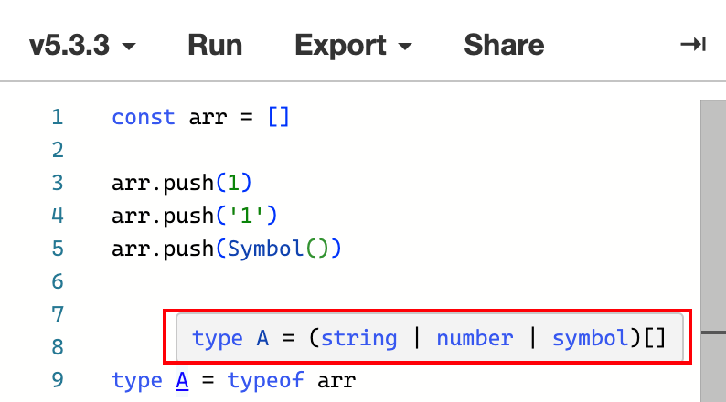

# 数组

在 **TypeScript** 中，数组中的元素通常会使用类型加以约束，以保证元素具有相同的特征。

## 声明

```TypeScript
const arr: string[] = []
```

变量 **arr** 被类型 **string[ ]** 进行约束，表征它是一个数组类型；**string** 表示数组中的元素类型均为 **string** 类型，而 **[ ]** 表示该变量是一个数组类型。

如果你希望可以在 **arr** 数组中同时存入 **number** 类型的数据，那么可以使用 **联合类型**。

```TypeScript
const arr: string|number[] = []
```

不难发现，**[ ]** 左侧部分的元素类型，可以根据实际情况加以修改。

## 案例

在实际开发中，很多关于 **list** 的数据都会通过接口请求进行获取，而这部分数据，通常又会保持相同的数据结构，如：

```TypeScript
const data = [
  { id: 1, name: "CoderMonkey-1", age: 18 },
  { id: 2, name: "CoderMonkey-2", age: 19 },
  { id: 3, name: "CoderMonkey-3", age: 20 }
]
```

这是一个用户列表，当前端拿到数据后会保存在 **store** 里并在页面中进行渲染，在存储时我们就可以根据这个结构编出通过类型约束的 **TypeScript** 代码。

```TypeScript
type Person = {
  id: number,
  name: string,
  age: number
}

const list:Person[] = data
```

在开发时，通过 **类型约束**，我们可以很轻易的在 **IDE** 中获取该类型和数据源中属性和方法的快捷提示。

## 数组的泛型表示

泛型是一个全新的概念，这里暂时提一下如何表示数据即可，后面会有专门的章节来说，代码如下：

```TypeScript
type Person = {
  id: number,
  name: string,
  age: number
}

const list:Array<Person> = data
```

**`Array<T>`** 是泛型数组的写法，**`Array<>`** 是固定的，中间的 **T** 表示元素的类型，可以是这里的 **Person**，也可以是 **string** 或者 **number** 等等其他可用的类型。

## 访问成员类型

通过 **数组类型** 来访问成员类型。

```TypeScript
type Person = {
  id: number,
  name: string,
  age: number
}

type T1 = Person[][0]
type T2 = Array<Person>[0]
type T3 = Array<Person>[number]
```

以上代码中的 **T1**、**T2**、**T3** 均表示相同的类型 **Person**，一下是具体分析分析：

**Person[][0]** 表示访问数组类型 **Person[]** 中第 **0** 个元素的类型，并赋值给 **T1**。

**`Array<Person>[0]`** 表示访问数组类型 **`Array<Person>`** 中第 **0** 个元素的类型，并赋值给 **T2**。

**`Array<Person>[number]`** 表示访问数组类型 **`Array<Person>`** 中第任意个元素的类型，由于数组的下标作为属性在通过 **[]** 形式访问时的类型都是 **number**, 因此，可以直接传入 **number** 类型（注意是 **number** 类型，而不是字符串 **"number"** 哟）从而访问到数组中任意元素的类型，并赋值给 **T3**。

## 类型推断

假设没有给数组添加 **类型约束**，只是默认赋值了一个空数组，此时会推断为 **any[]**。

<!--  -->

```TypeScript{1}
const arr = []

// 推断为
const arr: any[] = []
```

此时，可以往该数组中添加任意类型的元素，随着添加元素类型的不同，最后会推断出一个由这些元素类型组成的联合类型的数组类型。

<!--  -->

```TypeScript
const arr = []
arr.push(1)

// 推断为 number[]
type A = typeof arr // type A = typeof number[]
```

<!--  -->

```TypeScript
const arr = []
arr.push(1)
arr.push("1")
arr.push(Symbol())

// 推断为 (string | number |symbol)[]
type A = typeof arr // type A = typeof (string | number |symbol)[]
```

如果默认情况下，赋值了一个包含元素的非空数组，那么会根据元素的类型推断出具体的类型，如果添加的元素类型与推断类型不符合便会报错。

<!--  -->

```TypeScript
const arr = [1]

// 推断为 number[]
type A = typeof arr // type A = typeof number[]

arr.push("1")  // Argument of type 'string' is not assignable to parameter of type 'number' // [!code error]
```

## 只读数组

通过 **readonly** 关键字表明该数组 **只读**，对 **只读数组** 的 **增**、**删**、**改** 都会报错。

```TypeScript
const arr:readonly number[] = [1, 2, 3, 4]
```

## 只读数组的泛型表示

和普通泛型数组不同的是，仅仅将 **Array** 替换成了 **ReadonlyArray**。

```TypeScript
const arr:ReadonlyArray<number> = [1, 2, 3, 4]
```

还可以通过 **Readonly** 来表示。

```TypeScript
const arr:Readonly<Array<number>> = [1, 2, 3, 4]
```

上面的 **`Readonly<T>`** 本身是泛型中的只读表示，**T** 可以是任意类型，可以是 **string**，可以是 **number**，或者一个数组 **number[]** 等同于 **`Array<number>`**。

## 只读数组的断言表示

**as** 用于表示将数据断言为某个具体的类型，以跳过类型检查的目的，这里先提一下，后面会有专门的部分进行说明。

<!--  -->

```TypeScript
const arr = [1, 2, 3, 4, 5] as const

// 推断为
const arr: readonly [1, 2, 3, 4, 5] = [1, 2, 3, 4, 5]
```
