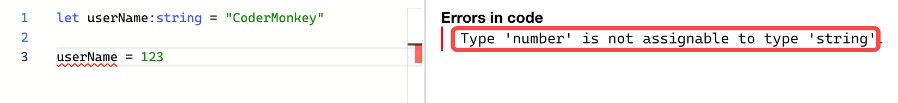
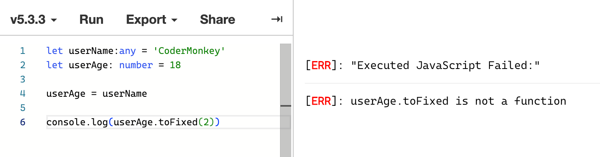
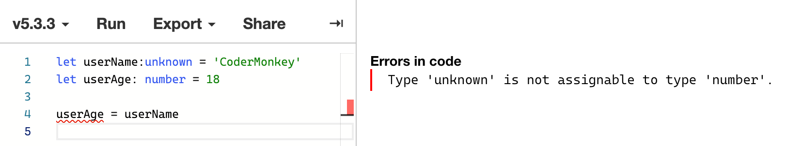
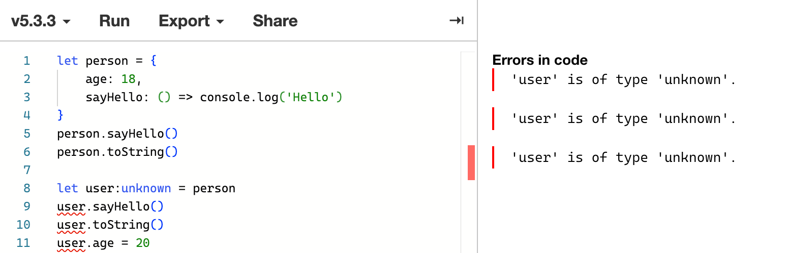
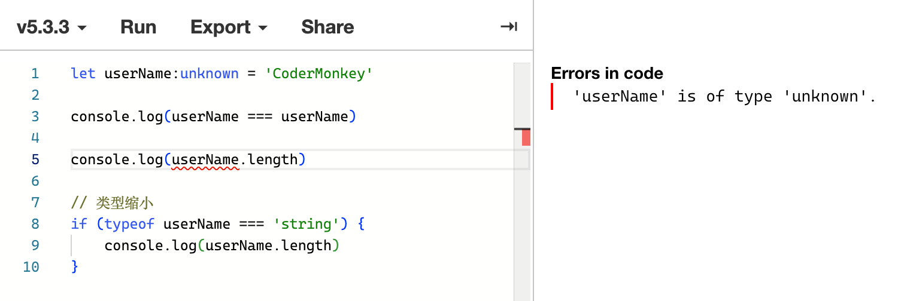
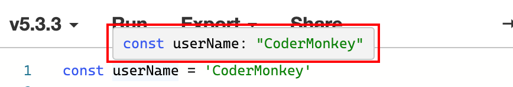
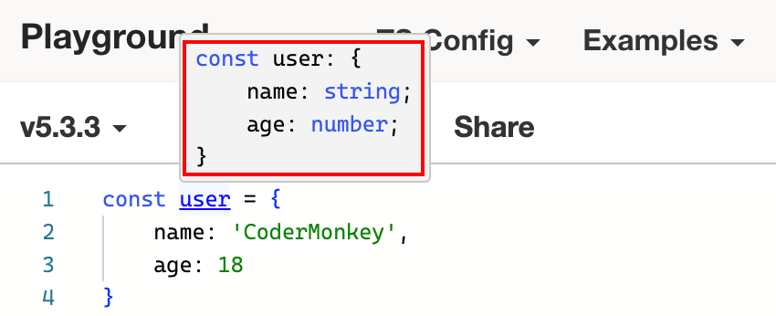
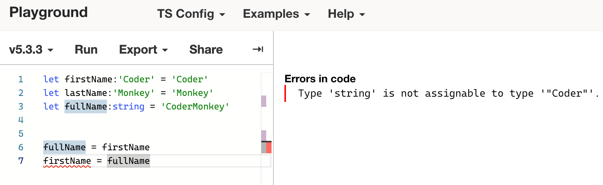
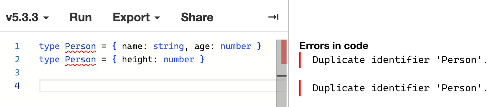
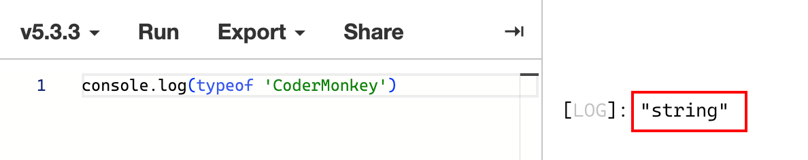

# 类型基础

## 类型声明

在 **TypeScript** 中，如果要为变量添加类型约束，只需要在变量的后面加上 **冒号:类型（: type）** 即可。

假设我要声明一个可变的 **userName** 变量并约束为 **字符串类型**，代码如下：

```TypeScript
let userName:string = "CoderMonkey"
```

通过 **string** 类型约束后的 **userName**，意味着在赋值时变量值的类型只能为 **相同类型** 或者为 **该类型的子集**（**相同类型** 很好理解，**类型子集** 后面会详解），否则编译器就会报错。

<!--  -->

```TypeScript
let userName:string = "CoderMonkey"

userName = 123  // Type 'number' is not assignable to type 'string'. // [!code error]
```

## string

字符串类型

```TypeScript
const userName:string = "Coder"
```

## number

数字类型（整数、浮点数、非十进制数、非大整数）

```TypeScript
const userAge:number = 18
const pi:number = 3.14
```

## bigint

大整数类型

```TypeScript
const bigInt:bigint = 100n
```

## boolean

布尔类型

```TypeScript
const isHandsome:boolean = true
```

## symbol

符号类型

```TypeScript
const sy:symbol = Symbol()
```

## null

空值类型，表示该类型的值是一个空值，并且值为 **null**

```TypeScript
const n:null = null
```

## undefined

未定义类型，表示变量已经声明过，但变量的值还没有定义，如果类型为 **undefined**，那么值也就为 **undefined**

```TypeScript
const u:undefined = undefined
```

## object

对象类型，包含了 **普通对象**、**数组**、**函数**、**Map**、**Set** 等

```TypeScript
const obj1:object = {}
const obj2:object = []
const obj3:object = () => {}
const obj4:object = new Set()
const obj5:object = new Map()
```

## any

任意类型，表示没有类型限制或约束，可以为该类型的变量赋值任意类型的值

```TypeScript
let userName:any = "CoderMonkey"
let userAge:any = 99

userName = 222
userName = undefined
userAge = null
userAge = "99"
```

当设置为 **any** 类型时，可以说已经失去了对该变量值类型的检查，只要编写的代码语句没有明显的语法错误，那就会被视为正确的逻辑；此时的 **TypeScript** 俨然已经变成了 **AnyScript**，也就可以间接等于你是在编写 **JavaScript**。

除此之外，**any** 类型还有一个很严重的问题，就是 **类型污染**，即类型为 **any** 的变量值可以赋值给其他任意类型的变量，如：

```TypeScript
let userName:any = 'CoderMonkey'
let userAge: number = 18

userAge = userName

console.log(userAge.toFixed(2))
```

由于 **any** 类型的值可以赋值给任意类型的变量，因此上面这段代码在 **TypeScript** 的环境中是不会报错的，这就对 **userAge** 的类型造成了 **污染**，当你尝试运行这段代码就会发现如下错误：

<!--  -->

```TypeScript
let userName:any = 'CoderMonkey'
let userAge: number = 18

userAge = userName

console.log(userAge.toFixed(2))  // userAge.toFixed is not a function // [!code error]
```

因此，非必要条件下，应当尽量避免使用 **any** 类型。

<!-- 需要注意的是，在 **TypeScript** 中，你可以将任意类型的值赋值给设置为 **any** 类型的变量，反过来却不行，因此可以理解为 **any** 类型包含了所有其他一切可能的类型，也就可以简单的理解为 **any** 类型是所有类型的 **父类型**，其他类型都是 **any** 类型的 **子类型**，**子类型** 的值可以赋值给 **父类型** 约束的变量，反之就不行。

因此，**any** 类型在 **TypeScript** 中也被称之为 **顶层类型（Top Type）**。 -->

## unknown

未知类型，可以理解为 **严格版的 any**，其主要作用就是为了解决 **any** 会产生的 **类型污染** 问题。

与 **any** 类型 **相同** 的是，可以将任意类型的值赋值给设置为 **unknown** 类型的变量

```TypeScript
let userName:unknown = "CoderMonkey"
let userAge:unknown = 99

userName = 222
userName = undefined
userAge = null
userAge = "99"
```

与 **any** 类型 **不同** 的是，不可以将类型为 **unknown** 类型的值赋值给其他类型的变量。

<!--  -->

```TypeScript
let userName:unknown = "CoderMonkey"
let userAge: number = 18

userAge = userName  // Type 'unknown' is not assignable to type 'number' // [!code error]
```

其次，设置为 **unknown** 类型的值 **不提供任何可用的属性和方法** ，即使该值本身或原型上已经存在。

<!--  -->

```TypeScript
let person = {
    age: 18,
    sayHello: () => console.log("Hello")
}
person.sayHello()
person.toString()

let user:unknown = person
user.sayHello()  // 'user' is of type 'unknown' // [!code error]
user.toString()  // 'user' is of type 'unknown' // [!code error]
user.age = 20    // 'user' is of type 'unknown' // [!code error]
```

再者，**unknown** 类型只能进行比较运算，如：==、===、!=、!==、||、&&、?、! 等等。

<!--  -->

```TypeScript
let userName:unknown = "CoderMonkey"

console.log(userName === "CoderMonkey")
console.log(userName.length)  // 'userName' is of type 'unknown' // [!code error]

// 类型缩小
if (typeof userName === "string") {
    console.log(userName.length)
}
```

在上面的例子中，如果对 **unknown** 类型的值进行比较运算，那么一切正常；倘若直接使用字符串的属性，编译就会报错。

这种情况下，可以使用 **typeof 操作符** 来对变量的类型进行 **缩小**，当明确该值的类型为 **string** 时，再去调用 **stirng** 本身的属性和方法那就不会有任何问题了，这一招（“类型缩小”）非常好使。

## never

空类型，可以理解为永远不会出现的值。当你确定某件事情永远不会发生时，就可以使用 **never** 类型。

主要使用场景如下：

场景一：函数 **throwError** 会在内部抛出一个错误，这意味着该函数永远也不会有返回结果

```TypeScript
function throwError(): never {
  throw new Error('error')
}
```

场景二：函数 **keepProcessing** 内部 **while** 循环条件为 **true**，这意味着该循环会一直执行下去，永远也不会停止，也就永远不会返回结果

```TypeScript
function keepProcessing(): never {
  while (true) {
    console.log('keepProcessing')
  }
}
```

上面两个函数的共同特点就是内部执行永远走不到头，因此永远也不会有一个明确的返回结果，因此，可以用 **never** 来进行标识。

## 值类型

一个具体的值，在 **TypeScript** 中就可以算做 **值类型**

```TypeScript
let userName:'CoderMonkey' = 'CoderMonkey'
```

变量 **userName** 的类型为值类型 **CoderMonkey**，这意味着 **userName** 的值只能为 **CoderMonkey**，不能是其他任意类型的值；在 **TypeScript** 环境中编码时会有非常明确的代码提示。

这种情况就等同于通过 **const** 声明了 **userName** 变量，并且值为 **CoderMonkey**

```TypeScript
const userName = 'CoderMonkey'
```

## 联合类型

将多个不同的类型通过 **|** 联合起来组成一个新类型，这种方式称之为 **联合类型（Union Type）**

```TypeScript
let flag:boolean|1|0

flag = true
flag = false
flag = 1
flag = 0
```

变量 **flag** 可以用 **boolean** 来表示，也可以用 **0** 或 **1** 来表示，所以就可以使用 **联合类型**，只要值的类型符合其中某个类型即可。

在处理 **联合类型** 的数据时，如果需要调用不同类型的属性或者方法，往往需要使用 **类型缩小**，即先判断值的类型，然后再去进行处理，前面也有提到。

## 交叉类型

将多个不同的类型通过 **&** 联合起来组成一个新类型，这种方式称之为 **交叉类型（Intersection Type）**

```TypeScript
let fullName: { firstName: string } & { lastName: string } = { firstName: 'Coder', lastName: 'Monkey'}
```

变量 **fullName** 的类型实际上是一个 **object**，但这个 **object** 需要同时包含 **firstName** 属性和 **lastName** 属性，简单的说，利用 **&** 就是将多个对象类型进行 **合并** 成一个满足他们所有对象约束的新类型。

## 类型推断

如果在声明变量时没有添加类型约束，**TypeScript** 会根据关键字和给定值的类型自动进行类型推断（鼠标悬浮到变量名上会弹出对应提示）。

使用 **const** 声明，赋值为字符串的值被推断为 **值类型**。

<!--  -->

```TypeScript{1}
const userName = "CoderMonkey"

// 推断为
const userName: "CoderMonkey" = "CoderMonkey"
```

使用 **const** 声明，赋值为对象的值被推断为包含 **相应属性** 的 **对象类型**。

<!--  -->

```TypeScript
const user = {
    name: "CoderMonkey",
    age: 18
}

// 推断为
const user: {
    name: string;
    age: number;
} = {
    name: "CoderMonkey",
    age: 18
}
```

在 **TypeScript** 中，**类型约束** 不是必须的，可以加，也可以不加，如果是一些基本类型的值比如 **string**、**number** 往往可以利用 **类型推断** 的机制省略不写；但如果是一些非常复杂的数据类型，**TypeScript** 就不能保证可以一定可以推断出正确的数据类型了，因此，在大型项目的复杂场景下，显示的 **类型约束** 就显得极为重要了。

## 类型兼容

**类型兼容** 主要是指不同类型之间的兼容关系，通常会发生在类型的 **包含关系** 中。

```TypeScript
let firstName:"Coder" = "Coder"
let lastName:'Monkey' = "Monkey"
let fullName:string = "CoderMonkey"
```

上面这段代码中，**firstName** 和 **lastName** 都被具体的 **值类型** 加以约束，意味着我只能赋值为这个具体的值，好比说写死了两个不能改变的 **常量**；而下面的 **fullName** 通过 **string** 进行约束，意味着只要值的类型满足 **string** 类型，就可以赋值给它，因此，**string** 相比于 **值类型** 而言具有更广的范围，简单的说，就是 **string** 类型包含了 **值为字符串的值类型**，**string** 是 **值为字符串的值类型** 的父类型，反之，则为 **子类型**。

<!--  -->

```TypeScript
let firstName:"Coder" = "Coder"
let lastName:'Monkey' = "Monkey"
let fullName:string = "CoderMonkey"

fullName = firstName
firstName = fullName  // Type 'string' is not assignable to type '"Coder"'.// [!code error]
```

可以看到，子类型的值可以赋值给父类型，反过来就会报错，这个机制很好理解：

父类型 **string** 的范围更大，除了可以是 **Coder** 或者 **Monkey** 之外，也可以是其他一切类型为 **string** 的值，加上 **值类型** 的值又是固定不变的，你将一个不确定的 **string** 变量赋值给 **常量** 本身就是有问题的，所以，报错是必然的。

因此不难得出如下结论：

**父类型兼容子类型，只要是可以使用父类型的变量，子类型同样也可以使用，反之就会报错**。

## type

如果想要给类型起别名，可以利用 **type** 进行实现。

```TypeScript
// type User = { name: string, age: number }
const user: { name:string, age: number } = { name: "CoderMonkey", age: 18 }
```

上面代码为 **user** 进行了 **类型约束**，一个包含 **name** 和 **age** 的对象，试想一下，如果下次我又声明一个 **teacher** 变量也想使用这个 **类型约束** 怎么办？要么重新写一份，要么拷贝过来，在这种情况下，就显得费时费力了，因此，可以将该类型抽离出来，单独定义一个新的别名，下次直接使用定义的别名类型即可。

```TypeScript
type Person = { name: string, age: number }

const user: Person = { name: "CoderMonkey", age: 18 }
const teacher: Person = { name: "CoderMonkey Teacher", age: 19 }
const student: Person = { name: "CoderMonkey student", age: 8 }
```

这样使用是不是就显得非常灵活了，同时也可以提升代码的可读性和可维护性。

需要明确的是，无法使用 **type** 同时定义两个同名 **Type**

<!--  -->

```TypeScript
type User = { name: string, age: number }  // Duplicate identifier 'User'. // [!code error]
type User = { height: number }             // Duplicate identifier 'User'. // [!code error]
```

通过 **type** 声明的 **对象类型**，在每一个 **key:value** 后面可以写 **,** 可以写 **;** 也可以留空不写

为了和 **对象字面量** 的特点保持一致，在开发中，我个人更推荐在每一个 **key:value** 后面写上 **,** 最后一个 **key:value** 后面留空，但以下三种在 **TypeScript** 中都是合法的

```TypeScript
type Person = {
    name: string,
    age: number
}
```

```TypeScript
type Person = {
    name: string;
    age: number
}
```

```TypeScript
type Person = {
    name: string
    age: number
}
```

## typeof

在 **JavaScript** 中，**typeof** 用于获取值的类型，其结果是一个字符串，如：

<!--  -->

```TypeScript{1}
console.log(typeof "CoderMonkey")  // string
```

在 **TypeScript** 中，除了获取变量的类型之外，还可以将获取到的变量类型赋值给新的 **Type**

```TypeScript
type Person = {
    name: string,
    age: number
}

const user:Person = {
    name: 'CoderMonkey',
    age: 18
}

console.log(typeof user.name)

type NameType = typeof user.name
type AgeType = typeof user.age
```

需要明确的是：**typeof** 后面的参数只能是一个 **值**，而不能是一个类型。
