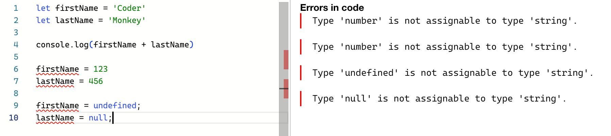

# TypeScript 学习笔记

<!-- ## 介绍

今天是 2024 年 1 月 18 日，刚刚花了一周时间，学习了阮一峰老师所写的 [《TypeScript 教程》](https://wangdoc.com/typescript/)，收益巨大，因此写下这篇笔记，用于记录学习点滴。 -->

## 概述

**TypeScript**（简称 TS）是一种由微软开发的开源编程语言。它是 **JavaScript** 的超集，在 **JavaScript** 基础上添加了一些额外的功能和语法，并引入了更强大、更严格的类型系统，用于实现静态类型检查。

## 类型

如果两个值具有某种相同的特征，就可以说，他们属于同一种类型（Type），如：

```JavaScript
// 在 JavaScript 中， firstName 和 lastName 都属于字符串类型
const firstName = "Coder";
const lastName = "Monkey";
```

## 动态类型 vs 静态类型

我们都知道，**JavaScript** 就是典型的动态类型语言，如：

```JavaScript
let firstName = "Coder";
let lastName = "Monkey";
console.log(firstName + lastName) // CoderMonkey

// 赋值为 Number 类型
firstName = 123;
lastName = 456;
console.log(firstName + lastName) // 579

// 赋值为 undefined 和 null 类型
firstName = undefined;
lastName = null;
console.log(firstName + lastName) // NaN
```

在上述代码中，原本定义好的 _firstName_ 和 _lastName_ 默认我给了字符串类型，在后续的赋值过程中，我也期望可以一直给他赋值为字符串类型，但是在 **JavsScript** 中，我却很难对后续赋值的变量类型加以限制，这可能就导致了赋值为其他类型的变量时，无法预估输入的结果到底是什么，也就可能会对我们的代码产生带来潜在的问题。

接着我们在 **TypeScript** 环境中来运行以上代码，此时就会直接出现红线报错，告诉我们只可以将 **string** 类型的值赋值给 _firstName_ 和 _lastName_，这就是 **静态类型** 的好处，可以让我们在编写代码时提前规避掉因为类型不同而可能会导致出现的问题。



## :pink_heart: 静态类型的优势

**更早发现错误**： 静态类型检查在编译阶段就能够捕获一些潜在的错误，如类型不匹配、未定义的变量等。这使得开发者能够更早地发现和修复问题，避免在运行时产生意外的错误。

**增强代码可读性**： 类型信息使得代码更加自文档化，提供了关于变量、函数参数和返回值的明确说明。这有助于开发者更容易理解代码，提高代码的可读性和可维护性。

**提高开发效率**： 静态类型语言通常配有强大的集成开发环境（IDE）和工具支持，例如智能代码补全、代码导航、重构等功能。这些工具可以显著提高开发效率，尤其在大型项目中更为明显。

**规范开发流程**： 类型系统强制定义了变量的类型和函数的签名，从而规范了开发流程。这有助于团队成员之间的沟通，提高代码的一致性和可维护性。

**优化性能**： 编译器在进行静态类型检查的同时，可以进行一些优化，生成更高效的目标代码。这可能导致静态类型语言在一些情况下比动态类型语言执行速度更快。

**更好的工程化支持** ： 在大型工程项目中，静态类型语言通常更容易管理和维护。类型信息能够帮助团队更好地组织和理解代码，减少潜在的错误，提高项目的可维护性。

**代码重构的支持** ： 静态类型语言对代码重构提供更好的支持，因为编译器可以根据类型信息检测出潜在的问题，帮助开发者更安全地进行代码重构。

## :broken_heart: 静态类型的劣势

**繁琐的类型声明**： 静态类型语言通常需要在代码中显式地声明变量的类型，这可能使得代码显得冗长和繁琐。对于简单的代码而言，这可能会感觉不必要。

**学习曲线**： 对于一些初学者来说，静态类型语言的学习曲线可能较陡峭。需要理解类型系统、类型注解的语法以及如何正确地使用类型。

**开发速度相对较慢**： 类型声明和类型检查会增加开发时的一些额外工作，导致相对于动态类型语言而言，开发速度可能较慢。特别是对于快速原型开发和小型项目，这可能被认为是一种不必要的负担。

**灵活性较差**： 静态类型系统要求变量在声明时就确定类型，这可能导致在一些情况下难以表达一些灵活的数据结构或模式。相比之下，动态类型语言在这方面通常更为灵活。

**可能引入冗余代码**： 有时为了满足类型系统的要求，开发者可能需要添加一些额外的类型声明或转换代码，这可能会使得代码看起来冗余。

**不适用于所有场景**： 静态类型语言并不是适用于所有的开发场景。在一些轻量级、快速迭代的项目中，动态类型语言可能更为合适。

**类型系统复杂性**： 一些复杂的类型系统可能会对开发者提出较高的要求，尤其是在大型项目中。理解和使用高级的类型特性可能需要更多的学习和经验

## 总结

总体而言，静态类型语言适用于需要更强大工具支持、更严格规范开发流程、更早发现潜在问题的场景。这些优点使得静态类型语言在大型项目和团队中广泛应用，并成为许多开发者的首选之一；但是具体是使用静态类型语言还是动态类型语言通常取决于项目的特性、团队的经验和个人偏好，也要根据实际情况进行决定。
