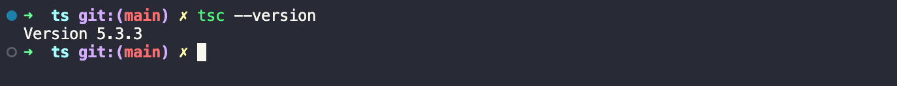
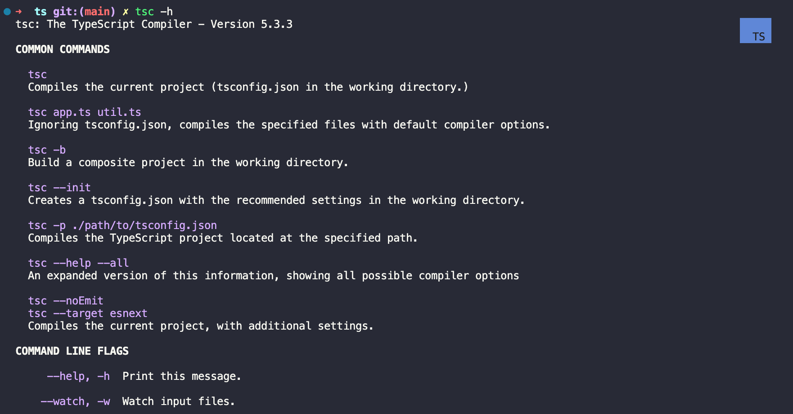
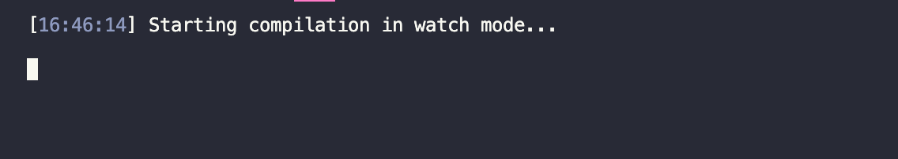
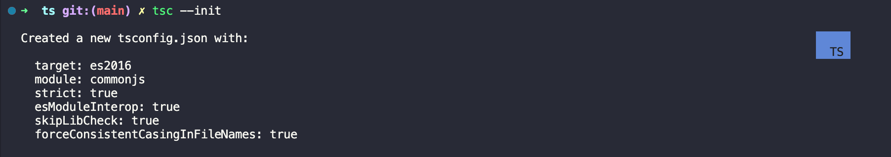

# 编译器

## 版本

```bash
tsc --version
```

<!--  -->

## 帮助

```bash
tsc --help
```

<!--  -->

如需查看所有的帮助信息，可以加上 _--all_ 参数。

```bash
tsc --help --all
```

## 编译

在当前目录下，将 _.ts_ 文件编译为 _.js_ 文件。

```bash
tsc index.ts
```

如需生成指定的 _.js_ 文件名，可以添加参数 _--outFile_ 并跟上新的文件名。

```bash
tsc index.ts --outFile ./bundle.js
```

除此之外也可以通过 _--outDir_ 参数指定 _.js_ 文件的输出目录。

```bash
tsc index.ts --outDir ./dist
```

执行此命令，则会在当前文件夹下生成 _dist_ 目录存放生成的 _.js_ 文件。

除了 _index.ts_ 之外，可能你的项目中还有很多其他的 _.ts_ 文件，如 _a.ts_ 、_b.ts_ 等等，如果都需要编译成 _.js_ 文件可以执行如下命令：

```bash
tsc index.ts a.ts b.ts
```

文件名之间通过空格进行隔开，执行完成后，就会生成对应 _.ts_ 文件的 _.js_ 文件，如果你更喜欢将生成的 _ts_ 文件都放在一个 _.ts_ 文件中，可以使用上面的 _--outFile_ 进行指定。

```bash
tsc index.ts a.ts b.ts --outFile bundle.js
```

切换回 _index.ts_ 添加如下代码：

```bash
const userAge = 18;
```

此时，_ts_ 代码已经更新，只有再次手动执行 `tsc index.ts` 才会生成包含新代码的 _.js_ 文件，如果说每次对 _.ts_ 文件的修改都需要手动执行才能进行编译，那无疑是一件非常痛苦的事情，所以，实际开发中，我们肯定不会这么去做，因为我们能想到的痛点，其实编译器早就帮我进行实现好了。

通过添加 _--watch_ 参数用于监视文件或目录的变化，保存后会自动将 _.ts_ 文件编译为代码更新后的 _.js_ 文件，如：

监视某个文件的变化

```bash
tsc --watch index.ts
```

执行上述命令后，会开启一个新的进程用于监视 _index.ts_ 代码的变化。

<!--  -->

监视当前目录中所有 _.ts_ 文件的变化

```bash
tsc --watch ./*.ts
```

执行上述命令后，会开启一个新的进程用于监视当前目录下所有 _index.ts_ 代码的变化。

作为初学者而言，以上指令可能会比较常用一些，但随着项目的复杂度逐渐提升，关于参数的配置可能也会越来越繁琐，因此单单通过命令行来处理参数就显得愈发无力了；此时就可以抛开命令行单独为项目添加 _tsconfig.json_ 这样的配置文件来进行处理，省时且高效，有关于更多的配置项，可以通过 _tsc --help --all_ 来进行查阅。

## 更多 tsc 配置

https://www.typescriptlang.org/docs/handbook/compiler-options.html

## 配置文件

通过 _tsc --init_ 为项目初始化 _ts_ 的配置文件

```bash
tsc --init
```

会生成包含如下默认配置的 _tsconfig.json_ 文件，点击该文件会发现除默认配置项之外，其余的配置都已经被注释掉了，并且在每个配置项后面都会有注释进行说明，可以很轻易的知道每个配置项的具体作用。

<!--  -->

```bash
Created a new tsconfig.json with:

  target: es2016
  module: commonjs
  strict: true
  esModuleInterop: true
  skipLibCheck: true
  forceConsistentCasingInFileNames: true
```

需要提及的是，如果有该配置文件存在，当你要编译项目中所有的 _.ts_ 文件可以直接执行 `tsc`；如果要监视项目中所有 _.ts_ 文件的变化可以直接执行 `tsc --watch`，因为 _tsc_ 会自动读取你的配置文件。

除了可以使用 _tsc --watch_ 来启动项目之外，你也可以将该命令配置 _package.json_ 的 _script_ 字段中，这样下次启动也会更加方便，特别是你有许多参数需要传递给该命令的时候。

```json{3}
{
  "scripts": {
    "dev": "tsc -w"
  }
}
```

## 更多参数配置

https://www.typescriptlang.org/tsconfig

## 案例

假设我需要通过 _tsconfig.json_ 配置来将编译后的文件通通放在 _dist_ 目录中，应当如何处理呢？

```json{9}
{
  "compilerOptions": {
    "target": "es2016",
    "module": "commonjs",
    "esModuleInterop": true,
    "forceConsistentCasingInFileNames": true,
    "strict": true,
    "skipLibCheck": true,
    "outDir": "dist"
  }
}
```
